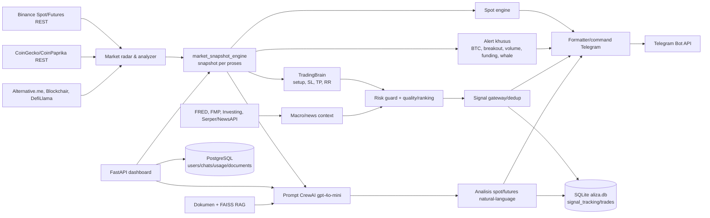

# 02 — Arsitektur dan Alur Data

> **Status: SUPERSEDED.** Snapshot pada 2026-07-21. Kondisi sistem terkini ada di `docs/README.md` dan report Fase 1–4 (`docs/reports/` — lihat Bagian 3). Jangan jadikan dokumen ini sebagai acuan status aktif.

## Gambaran arsitektur

Aliza AI saat ini adalah sistem analisis dan notifikasi, bukan execution engine. Ia mengumpulkan data REST, membuat snapshot in-memory, menghasilkan kandidat setup deterministik dan analisis LLM, lalu mengirim teks melalui Telegram. Tidak ada pengiriman order ke exchange.

## Akuisisi data

Semua koneksi pasar yang ditemukan memakai REST/HTTP. Tidak ditemukan implementasi WebSocket.

| Sumber | Cara dan penggunaan | Timeframe/data |
|---|---|---|
| Binance Spot | `engine/market/market_analyzer.py`, `klines_cache.py`, `binance_balance.py` | ticker harga; ticker 24 jam; kline `4h` dan `1d`, masing-masing limit 100; akun spot bertanda tangan hanya untuk saldo USDT |
| Binance USDT-M Futures | `engine/market/funding_rate_monitor.py`, `crypto_intelligence.py`, `liquidation_monitor.py`, `market_radar_pro.py` | premium index/funding, open interest saat ini, riwayat OI, global long/short ratio |
| CoinGecko | `market_analyzer.py`, `dynamic_universe.py`, `coin_id_resolver.py`, radar | daftar market, chart 90 hari sebagai fallback, global market, simple price |
| CoinPaprika | fallback radar global | market cap/dominasi global |
| Alternative.me | fear-and-greed | satu nilai indeks pasar |
| Blockchair | estimasi aktivitas whale BTC | transaksi BTC bernilai besar |
| DefiLlama | stablecoin | total sirkulasi stablecoin; kode menyebutnya “inflow” walau bukan delta arus |
| Coinbase | fallback harga tertentu | spot price REST |
| Deribit | opsi BTC | book summary/opsi pada radar pro |
| FRED | makro AS | seri ekonomi melalui `FRED_API_KEY` |
| Financial Modeling Prep | kalender ekonomi | event berdampak tinggi melalui `FMP_API_KEY` |
| Investing.com | kalender/fallback | kalender ekonomi dengan cache |
| Google Serper dan NewsAPI | pencarian/berita | konteks berita melalui `SERPER_API_KEY`, `NEWS_API_KEY` |
| Exchange-rate API | nilai tukar | konteks kurs |

Tidak ditemukan Bybit, OKX, Discord, Kafka, RabbitMQ, atau WebSocket. Beberapa sumber mempunyai fallback netral: misalnya fear-and-greed `50` dan dominasi `50` ketika pengambilan gagal; ini menjaga sistem tetap hidup tetapi dapat menyamarkan kegagalan data.

## Snapshot dan pemrosesan

`engine/market/market_snapshot_engine.py:update_market_snapshot()` mengambil radar global sekali per siklus, memanggil `engine.market_signal.generate_signal()` untuk setiap coin, memperkaya ticker 24 jam, intelligence, dan sinyal spot, lalu menukar dictionary snapshot secara atomik. Kegagalan coin dicoba ulang setelah 30 detik. Cache kline berada di memori per proses: TTL 300 detik untuk `4h` dan 600 detik untuk `1d`; cache data global 300 detik.

Snapshot juga per proses, bukan shared state. Akibatnya `aliza-telegram` dan `aliza-market` masing-masing mengunduh dan menghitung data sendiri; keduanya tidak berkomunikasi melalui IPC/database. Maksimum usia snapshot default 300 detik, sementara `opportunity_scanner.py:get_top_opportunities()` mensyaratkan 90 detik.

Pada runtime yang diperiksa, 17/21 coin tervalidasi. `BONE`, `FARTCOIN`, `HYPE`, dan `ZEREBRO` berulang kali gagal karena data kline/fallback tidak cukup. Request OI untuk `OM` juga menghasilkan HTTP 400. Snapshot parsial tetap dipublikasikan.

## Jalur pembentukan sinyal

1. `engine/market/market_analyzer.py:market_signal()` mengambil harga, kline `4h`/`1d`, menghitung MA, RSI, support/resistance dan multi-timeframe alignment.
2. Fungsi itu memanggil `engine/brain/trading_brain.py:TradingBrain.analyze()` untuk setup, entry, SL, TP1, TP2, RR dan confidence.
3. `engine/market/market_intelligence.py` dan `market_intelligence_engine.py` menambahkan rezim, whale/funding/OI, prediksi heuristik, dan risiko pasar.
4. `engine/trading/signal_engine.py:scan_for_signals()` menyaring dampak makro, RR minimum 3 dan confidence minimum 70, lalu hanya mengambil kandidat terbaik.
5. `engine/signal_engine.py:process_signal()` melakukan validasi risiko, dedup 15 menit, enrichment dan dispatch Telegram.
6. Di jalur lain, `interfaces/telegram_bot.py:_generate_spot_analysis()` dan `_generate_futures_analysis()` meminta CrewAI/OpenAI menyusun laporan natural-language. `_reorder_section_by_rr()` kemudian menormalisasi SL dan target secara mekanis sebelum dikirim.
7. Alert khusus (BTC, level, RSI, gerak besar, breakout, volume, funding, whale, berita) langsung diproses job Telegram masing-masing.

## Penyimpanan dan skema penting

### PostgreSQL

`core/database.py` membuka koneksi global ketika modul diimpor dan membuat tabel bila perlu:

- `users`: identitas/login, hash password, role, status aktif dan timestamp.
- `chats`: prompt/respons percakapan per user.
- `usage`: pencatatan penggunaan/token/biaya.
- `documents`: metadata dokumen/RAG.

Koneksi default menuju PostgreSQL lokal dengan database dan user dari konfigurasi; `DB_PASSWORD` disensor. Dashboard adalah consumer utama PostgreSQL.

### SQLite

`data/aliza.db` berisi tabel `users`, `chats`, `usage`, `documents`, `trades`, dan `signal_tracking`. Empat tabel pertama tampak sebagai skema legacy/duplikat PostgreSQL. Tabel penting trading:

- `trades`: coin, setup/side, entry, stop loss, target, quantity, risk, status, open/close timestamp dan hasil.
- `signal_tracking`: coin, setup, entry, SL, TP, status (`OPEN`, `WIN`, `LOSS`), PnL persen, created/closed timestamp.

`data/user_config.db` menyimpan konfigurasi portfolio/saldo per pengguna. `data/trade_history.json` menyimpan sampel riwayat untuk modul learning/drawdown, sedangkan `data/signal_state.json` menyimpan dedup gateway. Tidak ditemukan Redis.

Skema dan state terfragmentasi: API memakai PostgreSQL, trading lokal memakai SQLite, learning memakai JSON, snapshot/cache berada di RAM per proses.

## Service dan komunikasi

| Service/komponen | Komunikasi |
|---|---|
| `aliza-telegram.service` | Long polling Telegram; REST langsung ke semua sumber; scheduler internal; SQLite/JSON lokal; OpenAI/CrewAI |
| `aliza-market.service` | Long polling Telegram dan REST pasar secara independen; override non-primary mencegah dispatch utama |
| `aliza-dashboard.service` | FastAPI/Uvicorn loopback; PostgreSQL; snapshot pasar di prosesnya sendiri; inactive saat audit |
| Nginx host | Reverse proxy dashboard menurut bukti docs; konfigurasi host tidak menjadi bagian repo |

Tidak ada message bus. Komunikasi antarkomponen berlangsung tidak langsung melalui API eksternal dan sebagian file/database lokal. Lock snapshot hanya melindungi thread dalam satu proses.

## Keluaran ke pengguna

Keluaran utama adalah Telegram melalui `interfaces/telegram_bot.py` dan `interfaces/market_bot.py`. Variabel sensitif yang terkait: `TELEGRAM_BOT_TOKEN`, `TELEGRAM_CHAT_ID`, `DEFAULT_CHAT_ID`—hanya namanya dicatat. `IS_PRIMARY_DISPATCHER` menentukan proses yang boleh mengirim broadcast utama. Tidak ada integrasi Discord.

Dashboard/API tersedia di `api/server.py`, tetapi service dashboard inactive. Endpoint sensitif sekarang dilindungi JWT/role/rate limit; route health publik hanya mengembalikan status statis. Folder SPA yang dirujuk (`dashboard/`) kosong, sedangkan aset lama berada di `web/`, sehingga root API tidak menyajikan UI yang diharapkan.

## Ketidakpastian

- `TIDAK PASTI`: channel Telegram aktual dan identitas bot tidak dicantumkan karena nilainya rahasia/sensitif.
- `TIDAK PASTI`: kualitas data dari API eksternal pada semua waktu; audit hanya mengamati satu jendela runtime dan kode fallback.
- `TIDAK PASTI`: apakah PostgreSQL dashboard digunakan user produksi saat ini; service dashboard inactive dan audit tidak membaca isi env khusus `/etc`.
