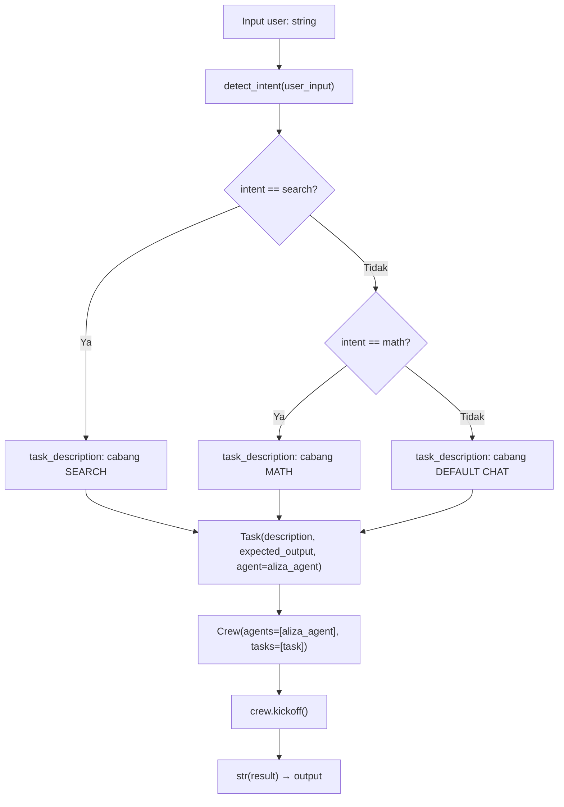
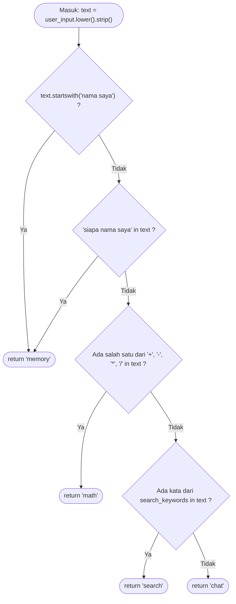

# Intent Routing Guide — Aliza-AI

**Tujuan:** Mendokumentasikan alur dari input pengguna hingga eksekusi `Task` CrewAI di `ask_aliza`, serta cara memperluas routing dengan aman.

**Scope:** `detect_intent` di `core/tool_router.py`, `ask_aliza` di `engine/brain/aliza_engine.py`, dan hubungannya dengan agen di `core/agent.py`. Tidak mencakup routing command Telegram (`/market`, dsb.).

**Terakhir diperbarui:** 2026-04-16

**Referensi:** `docs/instructions/ai-rules.md` §2 (mapping intent → perilaku `ask_aliza`); dokumen ini memperdalam alur, urutan kondisi, dan operasional penambahan intent.

---

## 1. Gambaran umum alur routing

Alur utama: string input → `detect_intent(user_input)` mengembalikan nama intent → `ask_aliza` memilih **satu** template `task_description` → `Task` + `Crew` → `crew.kickoff()` → string respons ke pemanggil.

**Titik fallback (ringkas):**

- **Di dalam `ask_aliza`:** intent yang **bukan** `search` atau `math` memakai cabang **default chat** (`else`) — termasuk intent `memory` dan intent `chat`.
- **Di luar fungsi ini:** `api/server.py` dan `api_server.py` dapat membungkus kegagalan dengan pesan fallback; kegagalan tool di dalam CrewAI dapat memicu exception atau string error — perilaku spesifik bergantung pada handler endpoint (lihat kode masing-masing).

### Diagram alur (Mermaid)



**Catatan:** Cabang **DEFAULT CHAT** melayani intent `chat` dan intent lain yang tidak punya `if` terpisah di `ask_aliza` (saat ini: `memory`).

---

## 2. Daftar intent yang ada saat ini

Sumber kebenaran: `core/tool_router.py` dan `engine/brain/aliza_engine.py`.

| Nama intent | Keyword / pattern pendeteksi (urutan evaluasi di kode) | Cabang di `ask_aliza` | Status | Contoh input pemicu |
|-------------|----------------------------------------------------------|-------------------------|--------|----------------------|
| `memory` | 1) `text.startswith("nama saya")` — 2) `"siapa nama saya" in text` | Sama dengan default: **tidak** ada `if intent == "memory"`; masuk `else` | **TERDETEKSI, TANPA CABANG** | `nama saya Budi` |
| `math` | `any(symbol in text for symbol in ["+", "-", "*", "/"])` **setelah** cek memory | `elif intent == "math":` — task matematika | **AKTIF** | `2 + 2` |
| `search` | Salah satu kata dari daftar `search_keywords` **setelah** memory dan math | `if intent == "search":` — task pakai internet search | **AKTIF** | `berapa harga ETH hari ini` |
| `chat` | Tidak cocok dengan rule di atas | `else` — task jawab dengan jelas | **AKTIF** | `jelaskan apa itu DeFi` |

Label status (gunakan persis untuk pencarian / checklist):

- **AKTIF** — intent terdeteksi **dan** punya cabang eksekusi tersendiri di `ask_aliza`.
- **TERDETEKSI, TANPA CABANG** — intent terdeteksi di router tetapi **tidak** punya cabang khusus; perilaku sama dengan default chat.
- **STUB** — dipakai di §6 untuk entri `config/agent.yaml`, bukan untuk baris intent pada tabel ini.

---

## 3. Decision tree routing (`detect_intent`)

Diagram berikut mengikuti **urutan `if` persis** seperti di `core/tool_router.py` (bukan urutan “logis” tema).



**Komentar di luar diagram (false positive & urutan):**

- Urutan **memory → math → search** menentukan hasil: tidak ada skor “confidence”; pemenang adalah **rule pertama** yang cocok.
- **Intent `math` rentan false positive:** pengecekan memakai **substring** simbol `+ - * /` di seluruh teks. Contoh: pair `BTC-USDT` mengandung `-`, sehingga dapat terklasifikasi sebagai `math` **sebelum** kata seperti `harga` atau `berita` dievaluasi untuk `search`. Teks yang menggabungkan `+` dengan kata kunci berita juga dapat masuk `math` lebih dulu.
- **Intent `memory` mengalahkan `search`:** jika substring `siapa nama saya` muncul bersama pertanyaan harga, hasil intent tetap `memory` (cabang tetap default chat di `ask_aliza`).

---

## 4. Cara menambah intent baru

### 4.1 Urutan langkah (konkret)

1. **Tentukan nama intent** — string tunggal, konsisten (`snake_case`), mis. `portfolio_check`.
2. **Edit `core/tool_router.py`:** tambahkan kondisi **di posisi yang disengaja** dalam rantai `if` (ingat: **urutan menentukan pemenang**). Letakkan kondisi yang lebih spesifik **sebelum** kondisi yang lebih umum (mis. sebelum cek simbol matematika jika intent Anda rentan bentrok dengan `-` / `+`).
3. **Edit `engine/brain/aliza_engine.py`:** tambahkan `elif intent == "nama_intent":` dengan `task_description` yang spesifik; pastikan semua intent baru ter-cover atau jatuh ke `else`.
4. **Sesuaikan `expected_output`** pada `Task` jika perlu (saat ini global: `"Jawaban yang jelas dan akurat."`).
5. **Uji** dengan kalimat yang memicu intent baru, kalimat yang harus tetap `search`/`math`/`chat`, dan regresi untuk intent lama.
6. **Perbarui dokumentasi:** `docs/instructions/ai-rules.md` §2 (jika perilaku `ask_aliza` berubah) dan dokumen ini.

### 4.2 Checklist anti bentrok

- [ ] Kata kunci intent baru **tidak** tertelan oleh rule `math` (simbol) atau `search` (daftar keyword) kecuali memang disengaja.
- [ ] Urutan `if` di `tool_router.py` sudah ditinjau untuk kasus gabungan (harga + simbol pair, dsb.).
- [ ] Intent baru punya **minimal satu** contoh input positif dan **dua** contoh negatif di dokumentasi atau test manual.
- [ ] `main.py` / `api_server.py` yang memanggil `detect_intent` secara langsung (jika ada) tetap konsisten — saat ini `ask_aliza` adalah pusat utama untuk jalur CrewAI.

### 4.3 Contoh minimal: intent fiktif `portfolio_check`

**Tujuan contoh:** menambah intent yang memicu instruksi task khusus (bukan mengubah logika bisnis portfolio sungguhan).

**1) `core/tool_router.py`** — sisipkan **setelah** blok memory dan **sebelum** blok math (agar pair `BTC-USDT` tidak memutus sebelum portfolio jika nanti keyword disesuaikan):

```python
    # =========================
    # PORTFOLIO CHECK INTENT (contoh dokumentasi)
    # =========================
    if "cek portfolio" in text or text.startswith("/portfolio_check"):
        return "portfolio_check"
```

**2) `engine/brain/aliza_engine.py`** — tambahkan cabang sebelum `elif intent == "math"`:

```python
    # =========================
    # PORTFOLIO CHECK INTENT (contoh dokumentasi)
    # =========================
    elif intent == "portfolio_check":

        task_description = f"""
Jawab permintaan terkait portfolio pengguna berikut dengan jelas.
Jika data portfolio tidak ada di pesan, minta pengguna menjelaskan aset atau konteksnya.

Permintaan:
{user_input}
"""

    # =========================
    # MATH INTENT
    # =========================
    elif intent == "math":
```

**3) Regresi:** pastikan input `2 + 2` masih `math`, `berapa harga BTC` masih `search`, dan teks tanpa keyword baru masih `chat`.

*Catatan:* Snippet di atas mengasumsikan penempatan `elif` berdampingan dengan cabang lain; sesuaikan indentasi dengan file aktual saat merge.

---

## 5. Penanganan ambiguitas & kasus tepi

**Tidak ada model confidence** di `detect_intent`: hasil deterministik dari urutan rule. “Ambiguitas” di sini berarti **konflik pola** yang menyebabkan klasifikasi tidak sesuai harapan pengguna.

### Contoh input realistis dan perilaku saat ini

| # | Input (contoh) | Intent yang keluar | Mengapa bisa mengecewakan user |
|---|----------------|---------------------|--------------------------------|
| 1 | `Berita terbaru tentang BTC + dampak ke altcoin` | `math` | Karakter `+` memicu blok **math** sebelum `search` mengevaluasi kata `berita` / `terbaru`. |
| 2 | `ETH-USDT mau entry, risk/reward bagus?` | `math` | Tanda `-` dan `/` dalam simbol pair memicu **math**. |
| 3 | `Siapa nama saya dan berapa harga SOL hari ini?` | `memory` | Substring `siapa nama saya` memicu **memory** lebih dulu; intent **search** tidak tercapai meski ada `harga` dan `hari ini`. |

### Rekomendasi perbaikan (opsional / TODO)

- Memisahkan deteksi **pair trading** (regex token) dari heuristik `math`, atau memindahkan pengecekan `search` lebih awal jika kata kunci berita/harga dominan.
- Menambah **prioritas eksplisit** (mis. `search` sebelum `math` untuk kalimat yang mengandung kombinasi keyword `search` + simbol) — memerlukan desain ulang urutan atau skor.
- Untuk gabungan `memory` + pertanyaan lain: memecah menjadi dua pesan atau memperluas template task default agar menangani multi-intent (di luar router saat ini).

---

## 6. Keterbatasan & gap yang diketahui

### 6.1 Intent terdeteksi tanpa cabang khusus di `ask_aliza`

- **`memory`:** dikembalikan oleh `detect_intent` tetapi `ask_aliza` **tidak** membedakan task; pengguna mendapat template **default chat** yang sama dengan `chat`.

### 6.2 `config/agent.yaml` vs runtime `core/tools.py`

Entri di bawah kolom **skill** pada `config/agent.yaml` **tidak** memuat daftar tool secara otomatis ke runtime. Tool aktif agen diatur di `core/tools.py` dan `skills_custom/`.

| Skill / entri di `config/agent.yaml` | Status di runtime |
|----------------------------------------|-------------------|
| `web_search` | Tersambung via `SerperDevTool` di `core/tools.py`. |
| `browser` | Tidak ada di `core/tools.py`. |
| `summarize` | Tidak ada di `core/tools.py`. |
| `calculator` | Tidak ada di `core/tools.py` (cabang `math` di `ask_aliza` mengandalkan model). |
| `datetime` | Tidak ada di `core/tools.py`. |
| `weather` | Stub: `skills_custom/weather.py` (`get_weather`) — mengembalikan pesan belum diimplementasi. |
| `python_executor` | Tidak ada di `core/tools.py`. |

**Catatan tambahan:**
- `config/agent.yaml` menulis `model: gpt-4o`, sedangkan runtime di `core/agent.py` memakai `gpt-4o-mini`. **Ini inkonsistensi** — perbarui yaml atau kode agar satu sumber kebenaran.
- Tool dimuat via `core/skill_loader.py` (`load_skills()`) dari `skills_custom/` — modul dengan atribut `tool` otomatis terdaftar.

### 6.3 `api_server.py` — **DEPRECATED**

Endpoint `POST /v1/generate-response` di `api_server.py` memanggil `ask_aliza` (via `asyncio.to_thread`) selaras dengan `POST /api/chat` di `api/server.py`, namun **endpoint ini deprecated** sejak 2026-04-16. **Client baru** harus memakai `POST /api/chat` di `api/server.py` (persist chat/usage + perilaku utama produk).

**Status:** Implementasi tetap memanggil `ask_aliza` dengan fallback selaras `/api/chat`. Respons menyertakan header `X-Deprecated: true` dan log WARNING per request untuk monitoring migrasi.

**Timeline:** deprecated sekarang → monitoring 30 hari → remove `api_server.py` / route ini jika tidak ada traffic.

**Riwayat:** Versi lama pernah membangun `Task` generik + fallback tidak konsisten — itu bug/regresi jika muncul kembali.

**Perbedaan yang sah:** `/v1/generate-response` stateless (tanpa persist PostgreSQL); `/api/chat` menyimpan chat dan usage.

---

*Akhir dokumen. Ubah bagian ini setiap kali `detect_intent` atau cabang `ask_aliza` dimodifikasi.*
