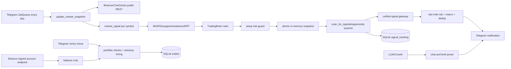

# Aliza AI Comprehensive Trading-System Audit

> **Status: SUPERSEDED.** Snapshot pada 2026-07-15. Kondisi sistem terkini ada di `docs/README.md` dan report Fase 1–4 (`docs/reports/` — lihat Bagian 3). Jangan jadikan dokumen ini sebagai acuan status aktif.

Audit time (UTC): 2026-07-15T02:55:34Z  
Repository: `/opt/aliza-ai`  
Branch / commit: `main` / `3592e321084197e9f835d18140b97087e0c92a7a`

## 1. Executive Summary

Aliza AI adalah sistem analisis crypto dan pengiriman notifikasi Telegram berbasis rule/technical analysis. Source yang diaudit **tidak memiliki jalur live order**: `/entry` dan `/close` hanya mengubah SQLite lokal. Integrasi private Binance hanya membaca saldo spot. Arsitektur aktual adalah market-data polling → snapshot in-memory → rule-based setup/risk filter → Telegram signal, ditambah tracking simulasi lokal.

Temuan: **0 P0, 9 P1, 7 P2, 1 P3**. Skor: **25/100**. Readiness: **Research only**. Keputusan: **NO-GO untuk live trading**.

Lima risiko terbesar:

1. Candle Binance yang belum closed dipakai dan harga ticker ditambahkan lagi ke seri indikator.
2. Fallback multi-timeframe dapat memakai seri yang sama sebagai 4h dan 1d sehingga alignment tidak independen.
3. Tidak ada OMS, idempotency order, fill handling, reconciliation, atau protective stop exchange-side.
4. “Backtest/performance” tidak valid: tracker memakai harga snapshot, salah mengenali setup short, dan tidak memodelkan biaya/fill.
5. Dashboard admin terbuka serta credential/state/log memiliki permission world-readable.

Confidence audit: **High untuk source/static architecture; Medium untuk deployment exposure; Low untuk konfigurasi exchange aktual**, karena secret, database production, firewall, dan exchange account sengaja tidak diakses.

## 2. Audit Scope and Limitations

Diaudit: seluruh source Python relevan, entrypoint, dependencies, systemd/cron metadata, listener, file permissions, risk/signal/state path, market data, LLM path, dan deployment scripts. Tidak ditemukan `AGENTS.md` yang berlaku pada source tree; satu file berada di dependency `venv` dan tidak berlaku ke repo.

Tidak dilakukan: membaca nilai `.env`, menguji API key, menghubungi private exchange, membaca/mengubah database, menjalankan bot/server/worker, menjalankan migration, atau mengirim notifikasi/order. Runtime tersedia sebatas observasi read-only (`systemctl`, `ps`, `ss`, metadata file). Telegram bot aktif; dashboard juga aktif tetapi tidak dikelola unit `aliza-api` yang ditemukan.

Test dijalankan: parse AST read-only terhadap 110 file Python (110/110 lulus) dan static missing-import analysis. Test suite tidak dijalankan karena **tidak ada test file**. Import/API tests tidak dijalankan karena `core.database` membuka PostgreSQL dan menjalankan DDL/commit saat import (`core/database.py:L1-L86`).

## 3. Repository and Deployment Inventory

| Component | Path | Entrypoint | Responsibility | Runtime | External dependency | Status |
|---|---|---|---|---|---|---|
| Telegram app/scheduler | `interfaces/telegram_bot.py` | `main()` L6806 | Commands, snapshot jobs, signals, alerts | systemd active | Telegram, Binance/CoinGecko, SQLite | Implemented/active |
| Dashboard API | `api/server.py` | `scripts/run_dashboard.py` | Dashboard/chat/admin | manual process on `0.0.0.0:8001` | PostgreSQL, LLM | Implemented/active, unmanaged |
| Legacy API | `api_server.py` | FastAPI `app` | Deprecated chat endpoint | not observed | LLM | Implemented/not observed |
| CLI AI | `main.py` | module top-level loop | CrewAI chat | not observed | OpenAI/Serper | Implemented/not observed |
| Snapshot engine | `engine/market/market_snapshot_engine.py` | `update_market_snapshot()` | Poll/validate/atomic snapshot | Telegram job every 60s | public REST APIs | Implemented/active |
| Analyzer/strategy | `engine/market/market_analyzer.py`, `engine/brain/trading_brain.py` | `market_signal()`, `TradingBrain.analyze()` | Indicators and setup | snapshot path | public REST | Implemented/active |
| Signal gateway | `engine/signal_engine.py` | `process_signal()` | schema/risk/dedup/Telegram | scheduler path | Telegram | Implemented/active |
| Risk/sizing | `engine/risk_manager.py`, `engine/position_sizer.py` | validation/calculator | setup guard and advisory size | signal/manual entry | SQLite/config | Partial |
| Paper state | `engine/trading/trade_manager.py` | `create_trade()`, `close_trade()` | Local simulated positions | Telegram commands | SQLite | Implemented, not exchange state |
| Outcome tracker | `engine/trading/signal_tracker.py` | `record_signal()`, `check_open_signals()` | Heuristic signal outcomes | job every 10m | SQLite/snapshot | Implemented but invalid as backtest |
| Exchange integration | `engine/binance_balance.py` | `fetch_spot_balance()` | Signed read-only account balance | optional | Binance private REST | Read-only only |
| LLM | `core/agent.py`, `engine/brain/aliza_engine.py` | `ask_aliza()` | Chat/brief prose | API/Telegram brief | OpenAI/CrewAI | Outside order path |
| Database | `core/database.py`; `data/*.db` | import/SQLite calls | chats/users; paper state/config | active | PostgreSQL/SQLite | Fragmented state |
| Monitoring | `engine/monitoring/system_monitor.py` | `check_system_health()` | Snapshot age/count/BTC checks | Telegram watchdog | Telegram | Partial |
| Deployment | `/etc/systemd/system/aliza-telegram.service`, `scripts/deploy/*` | systemd/webhook scripts | process restart/deploy | Telegram active | systemd/git | Partial/inconsistent paths |
| Backtest/ML | not found | none | none | none | none | Not implemented |
| Tests/CI/container | not found | none | none | none | none | Not implemented |

Technology: Python 3, FastAPI/Uvicorn, python-telegram-bot/APScheduler JobQueue, requests/httpx, PostgreSQL, SQLite, CrewAI/OpenAI. Dependencies are mostly exact-pinned in `requirements.txt`; no Dockerfile, Compose, CI workflow, queue/broker, WebSocket market feed, trained ML artifact, or backtest engine ditemukan.

## 4. Actual Architecture

Tidak ada edge dari signal/risk ke exchange order. Fail-closed: gateway menolak bila risk checker error (`engine/signal_engine.py:L35-L55`). Fail-open: macro failure, strategy filter unknown/error, open-trade DB error, dan drawdown history error dapat melanjutkan (`engine/signal_engine.py:L62-L82`; `engine/strategy/strategy_filter.py:L19-L29`; `engine/risk_manager.py:L19-L26`; `engine/portfolio/drawdown_protector.py:L24-L44`).

## 5. End-to-End Signal Trace

Jalur representatif:

`interfaces/telegram_bot.py:snapshot_job` L6597-L6711  
→ `engine/market/market_snapshot_engine.py:update_market_snapshot` L196-L305  
→ `engine/market_signal.py:generate_signal` L10-L14  
→ `engine/market/market_analyzer.py:market_signal` L224-L427  
→ `engine/market/multi_timeframe_analyzer.py:analyze_multi_timeframe` L29-L78  
→ `engine/brain/trading_brain.py:TradingBrain.analyze` L92-L291  
→ `engine/risk_manager.py:validate_proposed_trade` L29-L62  
→ atomic snapshot swap L300-L305  
→ `engine/trading/signal_engine.py:scan_for_signals` L137-L292  
→ `engine/signal_engine.py:attach_strategy_source/process_signal` L232-L328  
→ `interfaces/telegram_bot.py:safe_dispatch` L258-L281  
→ Telegram `Bot.send_message` L269-L275.

Data harga berasal dari public Binance ticker/klines dengan CoinGecko fallback. Symbol menjadi `<COIN>USDT`; timeframe 4h/1d. Tidak ada validasi candle closed. Entry adalah ticker saat analisis; SL/TP berasal dari support/resistance rule. Confidence adalah heuristic RR/RSI. Position size hanya ditambahkan ke pesan. Aliran berhenti pada notification; tidak ada construction/submission/fill/reconciliation/exit exchange.

Manual `/entry`: `interfaces/telegram_bot.py:L1207-L1318` → portfolio checks/sizing → `trade_manager.create_trade()` → SQLite. `/close`: L1494-L1508 → SQLite status `CLOSED`; tidak ada exchange interaction.

## 6. Market-Data Assessment

REST polling, bukan WebSocket. Timeout tersedia; 429 hanya satu retry dengan sleep tetap. Tidak ada sequence, dedup candle, gap detection, source timestamp, clock-skew/NTP check, bid/ask/spread/depth, mark-vs-last gate, atau closed-candle filter. Snapshot punya local freshness/circuit breaker, tetapi timestamp menandai waktu koleksi, bukan usia candle/source. Cache in-memory hilang saat restart. UTC sebagian memakai naive `datetime.utcnow()` dan tampilan dikonversi WIB.

## 7. Strategy, AI, and ML Assessment

Strategy aktual rule-based: moving average, RSI, support/resistance, regime mapping, funding/macro/whale heuristics, dan multi-timeframe. Modul bernama “AI/prediction/probability” adalah deterministic scoring; tidak ditemukan training pipeline, target, scaler, artifact, model version, calibration, atau time-series split. LLM dipakai untuk chat dan prose brief; tidak membentuk order/size dan tidak memiliki edge ke executor. Output LLM bebas tidak schema-validated, tetapi dampaknya notification/prose, bukan live execution.

## 8. Signal-Engine Assessment

Payload punya symbol/setup/entry/SL/TP/confidence/source dan dedup key, tetapi tidak punya immutable unique signal ID, data-cutoff timestamp, strategy/model version, expiration/invalidation lifecycle, market type, atau link order. Dedup berbasis dict + TTL file lokal dan tidak atomic. Signal tracker terpisah memiliki SQLite ID tetapi direkam sebelum risk/dedup/dispatch sukses.

## 9. Risk-Management Assessment

Ada RR, maximum open simulated trades, advisory risk-per-trade sizing, max allocation, max total open risk, loss-streak gate, macro gate, dan data circuit breaker. Namun kontrol tersebar, sebagian hanya advisory, sebagian fail-open, dan tidak ada single authoritative pre-submit gate karena submission order tidak ada. Tidak ditemukan daily realized/total loss, maximum drawdown berbasis equity, leverage/margin/liquidation check, spread/slippage/liquidity, funding limit, atomic exposure reservation, manual kill switch, atau exchange-health gate.

Formula `risk_amount / abs(entry-stop)` benar hanya untuk linear spot-like units tanpa fees/gap/slippage/contract multiplier. Implementasi float, tidak menerapkan tick/step/min-notional/rounding exchange, dan tidak menolak NaN/infinity atau konfigurasi persentase di luar rentang.

## 10. Execution and OMS Assessment

Tidak ada order state machine, client order ID, idempotency exchange, timeout reconciliation, partial fill, cancel/replace, reduce-only, TIF, position side/mode, precision metadata, testnet/live switch, atau exchange-side stop. Karena tidak ada order submission, duplicate live order dan timeout-after-accept tidak terjadi **pada source saat ini**; sistem juga tidak boleh disebut live-capable.

## 11. State and Reconciliation Assessment

State tersebar di PostgreSQL (users/chat), SQLite `aliza.db` (paper trades dan signal tracking), SQLite `user_config.db`, JSON signal dedup, JSON trade history, dan snapshot in-memory. `trade_history_tracker` tidak dipanggil oleh entry/close, sehingga drawdown/confidence-learning memakai state terpisah yang tidak otomatis sinkron. Tidak ada exchange position/open-order reconciliation, startup reconciliation, event ordering, state transition enforcement, atau atomic reservation. Untuk paper position, SQLite lokal adalah source of truth; untuk exchange position tidak ada source of truth.

## 12. Backtest Validity Assessment

Tidak ditemukan backtest engine. Outcome tracker bukan backtest: memeriksa spot snapshot tiap 10 menit, tidak memakai OHLC/intrabar ordering, dan setup `PULLBACK SHORT` diperlakukan long karena hanya string persis `SHORT` dianggap short (`engine/trading/signal_tracker.py:L196-L220`). Fee, spread, slippage, funding, latency, fill, precision, liquidity, benchmark, OOS, walk-forward, sensitivity, Monte Carlo, dan survivorship tidak dihitung. Klaim profitabilitas tidak dapat dibuat.

## 13. Exit-Management Assessment

SL/TP adalah level saran dan disimpan lokal; tidak ditempatkan di exchange. `/close` hanya mengubah semua row OPEN untuk coin menjadi CLOSED. Tidak ada hard stop, trailing, partial TP, time stop, reduce-only, emergency close, over-close prevention, atau protection saat VPS/network mati.

## 14. Reliability and Deployment Assessment

Telegram systemd restart-always aktif dan memiliki SIGTERM handler. Snapshot swap memakai lock. Namun dashboard process sudah berjalan sejak April pada port 8001 tanpa unit aktif yang sesuai; `aliza-api.service` menunjuk repository lain. Deploy script memakai `/home/ubuntu/aliza-ai`, berbeda dari repo aktual `/opt/aliza-ai`. Tidak ada readiness dependency, resource limit, startup reconciliation, config schema validation, rollback, verified restore, atau environment isolation paper/live. Cron membuat backup source ke dalam repo dan backup eksternal tidak diverifikasi.

## 15. Monitoring Assessment

Ada logging, log rotation yang terlihat dari file rotasi, watchdog snapshot count/age/BTC, circuit-breaker alerts, serta signal rejection counts. Tidak ada metrics/alerts terstruktur untuk data gaps, source data age, order/fill latency, slippage, exposure/equity drawdown, reconciliation mismatch, DB health, active commit/model version, rate-limit budget, or unprotected position. Health endpoint selalu mengembalikan `ok` tanpa memeriksa DB/snapshot (`api/server.py:L86-L93`).

## 16. Security Assessment

`.env` production dipakai systemd dan mode-nya 0755; DB/log juga 0644 pada directory 0755/0775. Dashboard mendengar pada semua interface dan endpoint `/admin/stats`, `/admin/users`, `/api/dashboard/*`, dan `/api/chat` tidak memiliki auth dependency. Auth memakai SHA-256 langsung untuk password dan JWT memiliki non-empty literal fallback; token tidak diverifikasi oleh route lain. Telegram `/entry`, `/close`, dan banyak command tidak memanggil `_authorized_chat`. Actual firewall/TLS/API-key permission tidak diverifikasi. Dependency production umumnya exact-pinned; withdrawal permission/IP whitelist wajib diverifikasi manual.

## 17. Test-Coverage Assessment

Tidak ada unit/integration/E2E test. Static AST 110/110 lulus. Ditemukan tujuh import lokal yang targetnya tidak ada (sebagian optional), 297 `except Exception`, dan sekitar 80 pola exception-pass. Test kritis yang hilang: closed-candle, stale/gap, long/short level invariants, sizing properties/precision, concurrency duplicate, restart recovery, signal dedup crash window, partial fill/order timeout (sebelum live executor dibuat), reconciliation, auth, and historical replay/OOS.

## 18. Critical Findings

### ALIZA-001
Severity: P1 — High; Confidence: High; Category: Market data  
Title: Candle berjalan dan ticker current diduplikasi ke indikator.  
Evidence: `engine/market/market_analyzer.py:L81-L130`, `_get_binance_klines`; `L262-L278`, `market_signal`.  
Observed behavior: semua close REST termasuk candle terakhir diterima tanpa close-time check, lalu current ticker di-append lagi.  
Failure scenario: sinyal intrabar berubah tajam, MA/RSI/support bergeser dua kali oleh harga current, alert terkirim lalu candle berbalik.  
Trading/financial impact: false entry/exit dan unstable alignment.  
Root cause: tidak ada closed-candle cutoff dan seri ticker/candle dicampur.  
Recommendation: drop open candle berdasarkan close time; hitung feature hanya closed candles; simpan cutoff timestamp.  
Validation: replay pada boundary candle dan assert feature identik sampai candle close. Effort: M.

### ALIZA-002
Severity: P1 — High; Confidence: High; Category: Market data/strategy  
Title: Fallback 4h/1d tidak independen dan dapat menghasilkan alignment palsu.  
Evidence: `engine/market/market_analyzer.py:L300-L304`, `market_signal`; `engine/market/multi_timeframe_analyzer.py:L29-L78`.  
Observed behavior: saat salah satu klines kurang, seri `prices` yang sama dapat dipakai untuk kedua timeframe.  
Failure scenario: CoinGecko/daily proxy memenuhi dua threshold lalu dua trend identik dianggap strong/partial.  
Impact: gate TradingBrain menerima sinyal dengan konfirmasi timeframe semu.  
Root cause: fallback tidak melakukan resampling atau menandai timeframe unavailable.  
Recommendation: fail closed per timeframe atau resample timestamped OHLC closed candles secara benar.  
Validation: fixture outage per source harus menghasilkan UNKNOWN, bukan false alignment. Effort: M.

### ALIZA-003
Severity: P1 — High; Confidence: High; Category: Data freshness  
Title: Freshness gate mengukur waktu snapshot lokal, bukan freshness/kelengkapan data sumber.  
Evidence: `engine/market/market_snapshot_engine.py:L74-L94`, `L246-L305`, `L341-L398`.  
Observed behavior: snapshot timestamp diperbarui bila ada data valid, tanpa minimum universe/BTC/source timestamp/candle gap.  
Failure scenario: satu subset coin memakai data lama tetapi koleksi baru memberi timestamp fresh; scanner tetap berjalan.  
Impact: stale/partial data dapat menghasilkan sinyal.  
Root cause: validasi schema minimal dan tidak ada provenance per field/candle.  
Recommendation: enforce source timestamps, max candle age, closed status, expected coin set, gaps, and BTC prerequisite.  
Validation: stale/partial/gap/out-of-order injection tests. Effort: M.

### ALIZA-004
Severity: P1 — High; Confidence: High; Category: Backtest/model validation  
Title: Outcome statistics materially invalid; no backtest or OOS evidence.  
Evidence: `engine/trading/signal_tracker.py:L163-L220`, `check_open_signals`; repository-wide search found no backtest/training test.  
Observed behavior: point price decides WIN/LOSS; only setup exactly `SHORT` uses short logic; all actual `PULLBACK SHORT`-style setup follows long logic.  
Failure scenario: short hits TP but is recorded loss/open, or both levels cross between polls and ordering is fabricated.  
Impact: win rate/confidence adjustment and perceived strategy quality misleading.  
Root cause: snapshot tracker substituted for event-based backtest.  
Recommendation: quarantine metrics from decisions; build closed-OHLC next-bar simulator with costs and direction enum.  
Validation: deterministic long/short, same-bar SL/TP, gap, fee/funding, OOS/walk-forward tests. Effort: L.

### ALIZA-005
Severity: P1 — High; Confidence: High; Category: Risk  
Title: Risk controls are fragmented, incomplete, and partly fail-open.  
Evidence: `engine/risk_manager.py:L19-L62`; `engine/portfolio/risk_manager.py:L9-L44`; `engine/portfolio/drawdown_protector.py:L24-L44`; `interfaces/telegram_bot.py:L1254-L1303`.  
Observed behavior: DB/history errors can appear as zero positions or trading allowed; portfolio risk constants are declared but not enforced; manual entry uses a different gate.  
Failure scenario: state read fails or concurrent entries both pass, aggregate limit is bypassed.  
Impact: uncontrolled simulated exposure; unsafe foundation for any executor.  
Root cause: no authoritative atomic risk service/state reservation.  
Recommendation: one fail-closed pre-submit risk gate with daily loss/drawdown/exposure/health controls and atomic reservation.  
Validation: DB failure, concurrency, daily loss, drawdown, stale balance, and TOCTOU tests. Effort: L.

### ALIZA-006
Severity: P1 — High; Confidence: High; Category: Execution/reconciliation  
Title: OMS, exchange execution, reconciliation, and protective orders are absent.  
Evidence: `engine/binance_balance.py:L38-L79` only signed GET; `engine/trading/trade_manager.py:L81-L148`, `L250-L267` only SQLite.  
Observed behavior: entry/close never reach exchange.  
Failure scenario: adding a live call later would have no idempotency, timeout recovery, fill state, or stop protection.  
Impact: system cannot safely control capital or recover positions.  
Root cause: notification/paper tracker is being treated as trading architecture.  
Recommendation: do not enable live; design OMS state machine, client IDs, exchange-side stops, reconciliation and recovery first.  
Validation: mocked ACK-timeout, duplicate, partial-fill, cancel, restart, mismatch, reduce-only tests. Effort: L.

### ALIZA-007
Severity: P1 — High; Confidence: High; Category: Security  
Title: Production credential/state/log files are world-readable.  
Evidence: `.env` mode 0755; `data/aliza.db`, `data/user_config.db`, `logs/aliza.log` mode 0644; systemd uses `/opt/aliza-ai/.env`.  
Observed behavior: any local account can read sensitive files.  
Failure scenario: compromised low-privilege user copies Telegram/API/database credentials or portfolio/config data.  
Impact: bot takeover, data exposure, and possible exchange impact depending on unverified key permissions.  
Root cause: permissive filesystem mode.  
Recommendation: owner-only secret/state permissions, dedicated service user, rotate exposed credentials, verify trade-only/no-withdrawal/IP whitelist.  
Validation: permission audit and credential rotation evidence; do not print values. Effort: S.

### ALIZA-008
Severity: P1 — High; Confidence: High; Category: Application security  
Title: Internet-facing dashboard/admin routes lack authentication.  
Evidence: `scripts/run_dashboard.py:L28-L32`; `api/server.py:L126-L195`, `L202-L243`; `api/auth.py:L15-L48`, `L57-L119`; listener `0.0.0.0:8001`.  
Observed behavior: admin user list/stats and chat/dashboard routes have no auth dependency; password uses plain SHA-256; JWT fallback exists and tokens are not enforced.  
Failure scenario: remote client enumerates users/usage, drives LLM cost, or abuses registration/chat.  
Impact: confidentiality, cost, availability, and account integrity.  
Root cause: auth issuance disconnected from authorization.  
Recommendation: bind private interface until fixed; enforce modern password hashing, mandatory secret, JWT/RBAC/rate limit on every route.  
Validation: unauthenticated/role/rate-limit security tests. Effort: M.

### ALIZA-009
Severity: P1 — High; Confidence: High; Category: Authorization/state  
Title: Telegram entry/close commands are not restricted to authorized chat.  
Evidence: `interfaces/telegram_bot.py:L1207-L1318`, `L1321-L1330`, `L1494-L1508`.  
Observed behavior: `_authorized_chat` protects balance commands, not entry/close.  
Failure scenario: any bot user creates/closes paper positions and corrupts risk state/alerts.  
Impact: false portfolio state and risk decisions; future executor would be dangerous.  
Root cause: authorization applied per-handler inconsistently.  
Recommendation: global allowlist middleware/handler filter; deny when allowlist absent in production.  
Validation: unauthorized chat tests for every state-changing command. Effort: S.

### ALIZA-010
Severity: P2 — Medium; Confidence: High; Category: State/idempotency  
Title: Local trades and signal dedup are not atomic/idempotent.  
Evidence: `engine/trading/trade_manager.py:L8`, `L55-L78`, `L81-L148`; `engine/state_store.py:L8-L18`.  
Observed behavior: relative DB path, no trade uniqueness/state transition constraint, read-check-write split, and JSON overwrite without lock/atomic rename.  
Failure scenario: duplicate command/job or crash creates duplicates/corrupts dedup state.  
Impact: incorrect exposure and repeated notification.  
Recommendation: absolute config path, transactions, unique idempotency key, state machine, atomic file replacement or DB.  
Validation: concurrent writers and crash-injection tests. Effort: M.

### ALIZA-011
Severity: P2 — Medium; Confidence: High; Category: Auditability  
Title: Signal is recorded before risk/dedup/dispatch succeeds.  
Evidence: `interfaces/telegram_bot.py:L6685-L6709`; `engine/signal_engine.py:L269-L328`.  
Observed behavior: `record_signal` precedes `process_signal`; gateway can later reject or fail.  
Failure scenario: rejected/unsent signal enters performance history.  
Impact: phantom trades and biased statistics.  
Recommendation: persist lifecycle with generated/validated/sent/rejected states and record outcome only after sent ACK.  
Validation: risk reject, duplicate, Telegram timeout, and restart tests. Effort: M.

### ALIZA-012
Severity: P2 — Medium; Confidence: High; Category: Position sizing  
Title: Position sizing is advisory and not exchange-precision safe.  
Evidence: `engine/position_sizer.py:L48-L129`; `engine/trading/signal_engine.py:L253-L286`.  
Observed behavior: float math, fixed linear-unit assumption, no NaN/inf/config bounds, fees/slippage/leverage/contract/tick/step/min-notional absent.  
Failure scenario: displayed quantity is invalid or materially underestimates risk.  
Impact: unsafe manual sizing and unusable live quantity.  
Recommendation: Decimal/instrument metadata, conservative rounding, gap/slippage/fee buffer, strict finite/bounds checks.  
Validation: property tests across instruments and pathological inputs. Effort: M.

### ALIZA-013
Severity: P2 — Medium; Confidence: High; Category: Model validity  
Title: Confidence/probability labels are uncalibrated heuristic scores.  
Evidence: `engine/brain/trading_brain.py:L76-L88`, `L270-L280`; `engine/prediction/probability_engine.py:L10-L39`.  
Observed behavior: RR/RSI points and normalized rule scores are presented as confidence/probability without labels/calibration/OOS.  
Failure scenario: users interpret 70–85 as empirical chance of profit.  
Impact: overconfidence and improper sizing/decision-making.  
Recommendation: rename to heuristic score until calibrated using leakage-free OOS reliability/Brier analysis.  
Validation: calibration curves, Brier/log loss, regime stability. Effort: M.

### ALIZA-014
Severity: P2 — Medium; Confidence: High; Category: Signal reliability  
Title: Auto-alert threshold is unreachable.  
Evidence: `engine/alerts/auto_alert_engine.py:L10-L13`, `L60-L77`; `engine/brain/signal_quality_engine.py:L117-L129`.  
Observed behavior: auto alert requires score ≥160, while quality is clamped to 100.  
Failure scenario: intended alerts never fire, silently reducing coverage.  
Impact: missed signals/false operational confidence.  
Recommendation: define one score contract and boundary tests.  
Validation: max-quality opportunity must cross configured threshold. Effort: S.

### ALIZA-015
Severity: P2 — Medium; Confidence: High; Category: Reliability/database  
Title: API import mutates DB and health check is not a readiness check.  
Evidence: `core/database.py:L1-L86`; `api/server.py:L86-L93`.  
Observed behavior: global connection/cursor plus CREATE/commit at import; health always says running.  
Failure scenario: worker/import performs migration-like writes, stale connection breaks requests, health stays green while DB/snapshot fail.  
Impact: deployment/test side effects and false availability.  
Recommendation: explicit migration, pooled per-request connections, real readiness dependency checks.  
Validation: import-no-write, DB outage, stale connection, readiness tests. Effort: M.

### ALIZA-016
Severity: P2 — Medium; Confidence: High; Category: Test/code quality  
Title: No automated tests; broad exception handling hides control failures.  
Evidence: repository has 0 test files; static scan found 297 `except Exception` and ~80 exception-pass patterns; missing optional imports at `api/dashboard_api.py:L27-L42`.  
Observed behavior: critical fallback behavior is largely unverified and errors are often swallowed.  
Failure scenario: risk/data feature silently disables after refactor/dependency change.  
Impact: regression reaches active signal service undetected.  
Recommendation: risk-first unit/integration suite, typed contracts, narrow exceptions, failure metrics.  
Validation: CI must fail on critical fallback and contract regressions. Effort: L.

### ALIZA-017
Severity: P3 — Low; Confidence: High; Category: Deployment hygiene  
Title: Deployment paths/process ownership and worktree are inconsistent.  
Evidence: `scripts/deploy/deploy.sh:L3-L10` uses `/home/ubuntu/aliza-ai`; actual repo `/opt/aliza-ai`; dashboard process is active while matching service is inactive; worktree contains untracked empty `import`.  
Observed behavior: deploy script may update/restart a different tree; dashboard is unmanaged by discovered unit.  
Failure scenario: code deployed differs from audited commit or process survives updates.  
Impact: rollback/version ambiguity.  
Recommendation: single canonical path/unit, immutable release/version endpoint, clean deploy check.  
Validation: process CWD/commit equals release manifest after deploy. Effort: S.

## 19. Scorecard

| Category | Score | Max | Evidence / main deductions | Confidence |
|---|---:|---:|---|---|
| Strategy and model validity | 5 | 20 | deterministic rules exist; no calibration/OOS, invalid tracker | High |
| Risk management | 5 | 20 | basic RR/sizing/open-count; fragmented/fail-open/no daily loss | High |
| Market-data integrity | 7 | 15 | timeouts/snapshot gate; open candles, false MTF fallback, no source freshness | High |
| Execution and order lifecycle | 1 | 15 | no live submission/OMS/fill/reconciliation/stop | High |
| Backtest validity | 0 | 10 | no backtest; tracker is not valid simulation | High |
| Reliability and recovery | 3 | 10 | restart/lock/log rotation; no reconciliation/readiness/managed dashboard | Medium |
| Security | 1 | 5 | pinned deps; public admin and permissive secret/data modes | High |
| Monitoring and auditability | 3 | 5 | snapshot watchdog/logging; no execution/exposure/version metrics | Medium |
| **Total** | **25** | **100** | | |

## 20. Readiness Decision

**Research only — NO-GO untuk live trading.** Tidak ada P0 yang terbukti, tetapi P1 pada market data, strategy validation, risk, execution/reconciliation, dan security memblokir paper-to-live. Sistem bahkan belum memenuhi paper trading realistis karena entry/exit bukan fill simulation dan tidak ada accounting/fees. Shadow notification dapat dipakai hanya sebagai eksperimen setelah containment security dan dengan label “uncalibrated/research”.

## 21. Go-Live Blocking Checklist

- [x] Tidak ada P0 yang teridentifikasi dalam scope static audit.
- [ ] P1 pada risk/execution/reconciliation selesai.
- [ ] API withdrawal disabled diverifikasi manual.
- [ ] IP whitelist diverifikasi manual.
- [ ] Daily-loss limit aktif.
- [ ] Drawdown circuit breaker aktif berbasis equity.
- [ ] Kill switch diuji.
- [ ] Stop-loss exchange-side diuji.
- [ ] Duplicate-order test lulus.
- [ ] Timeout ambiguity test lulus.
- [ ] Partial-fill test lulus.
- [ ] Startup reconciliation test lulus.
- [ ] Position mismatch alert diuji.
- [ ] Stale-data gate source/candle diuji.
- [ ] Paper/live isolation diverifikasi.
- [ ] Out-of-sample backtest tersedia.
- [ ] Fee, slippage, spread, dan funding diperhitungkan.
- [ ] Shadow mode acceptance selesai.
- [ ] Paper-trading acceptance criteria terpenuhi.

## 22. Unknowns and Manual Verification

- Actual Binance key permissions, withdrawal disablement, and IP whitelist.
- Firewall/security-group exposure of port 8001; TLS/reverse-proxy/auth perimeter.
- NTP/clock drift status and exchange time synchronization.
- PostgreSQL schema/runtime health, backup contents, encryption, restore drill, and retention.
- Whether external `/opt/aliza-backups` jobs cover all SQLite/JSON state consistently.
- Telegram bot privacy/allowlist and actual subscriber set.
- Production `.env` values and paper/live separation (not read by design).
- Runtime logs/content, actual historical signal accuracy, and current positions (not read).
- Webhook daemon exposure/signature validation outside this repo.
- Why dashboard is a manual long-running process and which commit it loaded.

## 23. Final Conclusion

Jawaban eksplisit:

1. Arsitektur aktual: public REST polling → in-memory snapshot → rule engine → risk/dedup → Telegram; SQLite untuk simulated state.
2. Sinyal bergerak melalui call chain di §5 dan berhenti pada notification.
3. Jalur live order: **tidak ada**.
4. Model/strategy melewati risk? TradingBrain dan trade-signal gateway memanggil risk, tetapi manual `/entry` memakai gate berbeda dan beberapa failure fail-open; tidak ada final exchange gate.
5. Duplicate order live: tidak mungkin saat ini karena tidak ada order; duplicate simulated trade/notification mungkin.
6. Exchange accept lalu timeout: tidak ditangani karena executor/OMS tidak ada.
7. VPS restart dengan posisi terbuka: SQLite paper state bertahan; snapshot in-memory hilang; tidak ada exchange reconciliation.
8. Source of truth posisi: SQLite lokal untuk paper; exchange truth tidak dimodelkan.
9. Reconciliation lokal/exchange: tidak ada.
10. Stop-loss: level lokal/saran, bukan exchange-side.
11. Position sizing: formula dasar linear benar, tetapi unit/precision/fee/slippage/leverage belum exchange-ready.
12. Daily loss/drawdown: daily loss tidak ada; hanya loss-streak JSON yang fail-open.
13. Kill switch: tidak ada manual/live kill switch; hanya circuit breaker notification berbasis snapshot.
14. Stale data: dapat menghasilkan sinyal karena freshness lokal tidak membuktikan source/candle freshness.
15. Look-ahead backtest: tidak dapat dinilai karena backtest tidak ada; live feature memakai candle belum closed.
16. Biaya backtest: fee/spread/slippage/funding/latency tidak dihitung.
17. Logic backtest/live sama: tidak ada backtest untuk dibandingkan.
18. Confidence calibrated: tidak.
19. Output LLM langsung menjadi order: tidak; hanya chat/prose notification.
20. Paper/live terpisah: tidak ada live implementation atau environment contract; belum terverifikasi.
21. Secret berisiko: ya, dari permission filesystem dan auth fallback; nilai tidak diperiksa/ditampilkan.
22. Lima skenario terbesar: open-candle false signal; false MTF confirmation; stale partial snapshot; unauthorized/public control/data access; future/live position without OMS/stop/reconciliation.
23. P0 blocker: tidak ada P0 terbukti; P1 tetap memblokir live.
24. Test terpenting: closed-candle/data freshness, risk atomicity, historical OOS replay, auth, lalu OMS timeout/duplicate/partial-fill/restart sebelum executor dibuat.
25. Readiness: **Research only**.

